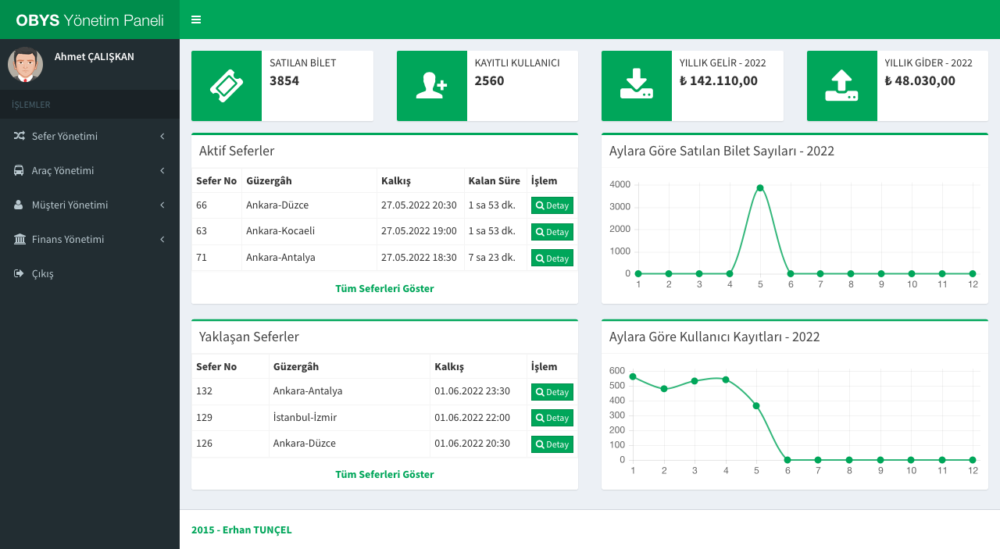

# Bus Ticket Management System

A Web project to manage bus tickets. This project is developed for practising purposes.

# Table Of Contents

- [Technologies Used](#technologies-used)
- [Features](#features)
- [Screenshots](#screenshots)
- [Launch](#launch)
- [Usage](#usage)

# Technologies Used

- JSP (Java Server Pages)
- Spring MVC
- Spring Security
- Hibernate
- MySQL
- Bootstrap
- JUnit
- Apache Tomcat

## Features

There are two roles: Admin and customer.

**Role: Admin**

- Voyage management (add, update, delete)
- Vehicle management (add, update, delete)
- Customer management (add, update, delete)
- Finance management (add, update, delete)

**Role: Customer**

- Buying tickets
- Making reservation
- Converting reservations to ticket
- Deleting tickets
- Updating user informations.

## Screenshots

<a href="./screenshots/btms-login-page.png">
	
</a> 


<a href="./screenshots/btms-admin-page.png">
	
</a> 


<a href="./screenshots/btms-customer-page.png">
	
</a> 

# Launch

- To build and run project:

	```bash
	$ git clone https://github.com/erhantuncel/BusTicketManagementSystem.git
	$ cd BusTicketManagementSystem
	$ mvn clean package -DskipTests
	$ docker-compose up
	```

# Usage

- You can access login page on [http://localhost:8080](http://localhost:8080)
- To populate sample data [http://localhost:8080/loadSampleData](http://localhost:8080/loadSampleData)
- After load sample data you can access admin and customer pages with credentials given below
	+ **Admin account :**  T.C number: 10987654321, Password: admiN123
	+ **Customer account :**  T.C number: 12345678910, Password: useR1234
